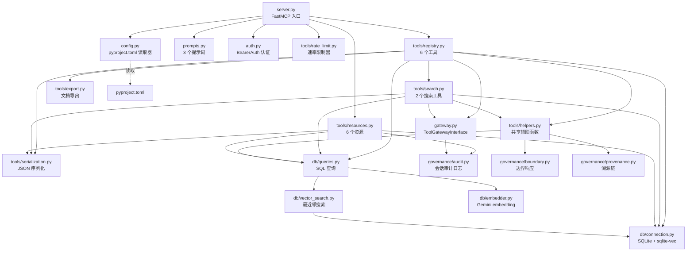
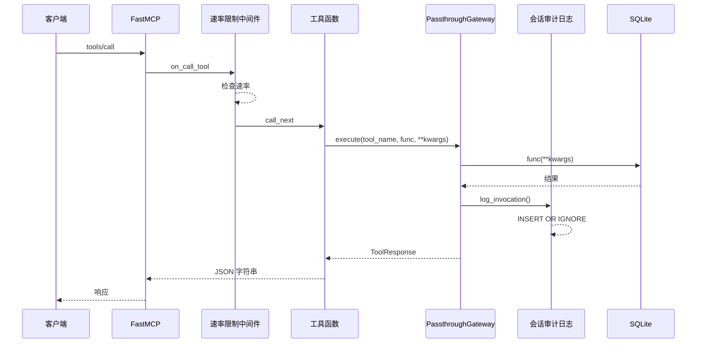
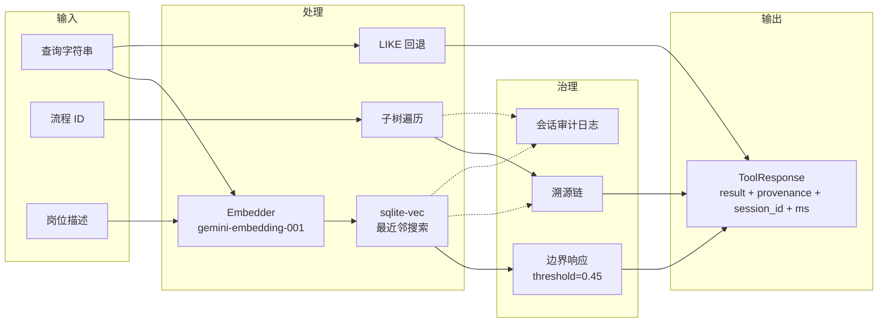

# O'Process MCP Server — 交付文档

> 版本: 0.3.0 | MCP 规范: 2025-11-25 | 日期: 2026-02-25

---

## 1. 服务器概述

**O'Process** 是基于开放流程框架 (OPF) 构建的 AI 原生流程分类 MCP Server。通过 Model Context Protocol 提供对 2,325 个业务流程和 3,910 个 KPI 指标的结构化访问。

### 核心能力

- **流程搜索** — 语义向量搜索 (gemini-embedding-001 + sqlite-vec) 并支持 LIKE 回退
- **流程分类体系** — 5 层层级树浏览
- **KPI 建议** — 3,910 个指标映射到流程节点
- **岗位-流程映射** — 将岗位角色映射到相关流程，附带置信度评分
- **职责说明书** — 生成完整的岗位描述文档，含溯源附录

### 数据来源

| 来源 | 条目数 |
|------|--------|
| APQC PCF 7.4 | 1,921 个流程 |
| ITIL 4 | 141 个节点 |
| SCOR 12.0 | 164 个节点 |
| AI 时代扩展 | 99 个节点 |
| **合计** | **2,325 个流程** |
| KPI 指标 | 3,910 个 |

双语支持：中文 (zh) + 英文 (en)。

### 技术栈

| 组件 | 技术 |
|------|------|
| 运行时 | Python 3.10+ |
| MCP 框架 | FastMCP 3.x |
| 验证 | Pydantic 2.x (`Annotated[..., Field(...)]`) |
| 数据库 | SQLite + sqlite-vec |
| 向量模型 | gemini-embedding-001 (768 维) |
| 打包 | uv + hatchling |
| 代码检查 | Ruff |
| 测试 | pytest + pytest-benchmark |

---

## 2. MCP 规范合规报告

基于 [MCP 规范 2025-11-25](https://modelcontextprotocol.io/specification/2025-11-25)。

### 2.1 MUST 要求 — 11/11 通过

| # | 要求 | 实现方式 | 位置 |
|---|------|----------|------|
| M1 | 服务器初始化与能力协商 | FastMCP 处理 `initialize` / `notifications/initialized` 生命周期 | `src/oprocess/server.py:73-78` — FastMCP 构造函数声明 tools、resources、prompts 能力 |
| M2 | Tool inputSchema 为有效 JSON Schema 对象 | 所有工具使用 `Annotated[..., Field(...)]` 配合 Pydantic 约束 | `src/oprocess/tools/registry.py:45-64` — 带正则模式的类型别名 |
| M3 | Tool 名称唯一 (1-128 字符, A-Z/a-z/0-9/_/-) | 8 个唯一的 snake_case 工具名称 | `src/oprocess/tools/registry.py`, `src/oprocess/tools/search.py` |
| M4 | 所有工具的输入验证 | Pydantic `Field(min_length, max_length, ge, le, pattern)` | `search.py:38-47`, `registry.py:45-64` |
| M5 | 访问控制 | `BearerAuthMiddleware` 用于 HTTP 传输，`hmac.compare_digest` | `src/oprocess/auth.py:63-132` |
| M6 | 速率限制 | `RateLimitMiddleware`（按客户端，可配置）通过 FastMCP Middleware | `src/oprocess/tools/rate_limit.py:23-72` |
| M7 | 输出清洗 | `response_to_json()` 配合 `ensure_ascii=False`，`json.dumps` 序列化 | `src/oprocess/tools/serialization.py` |
| M8 | Resource URI 验证 | 正则验证的 `_PROCESS_ID_RE`、`_SESSION_ID_RE` | `src/oprocess/tools/resources.py:33-51` |
| M9 | Prompt 输入验证 | `_validate_process_id()`、`_validate_lang()`、`_sanitize_role_name()` | `src/oprocess/prompts.py:13-50` |
| M10 | stdio 模式无 stdout 污染 | 使用 `logging` 模块配合 `StreamHandler` 输出到 stderr | `src/oprocess/server.py:25-38` |
| M11 | 标准 JSON-RPC 错误码 | `ToolError` (→ `-32602`)、`ResourceError` (→ `-32002`)、`McpError` | `registry.py:94-95`, `resources.py:43-44`, `rate_limit.py:53-61` |

### 2.2 SHOULD 要求 — 12/12 通过

| # | 要求 | 实现方式 | 位置 |
|---|------|----------|------|
| S1 | Tool 注解 (readOnlyHint 等) | `_READ_ONLY` 和 `_READ_ONLY_OPEN` ToolAnnotations 应用于所有工具 | `registry.py:39-42`, `search.py:23-26` |
| S2 | Tool 标题 | 所有 8 个工具配有人类可读的 `title` | `registry.py:72,99,135,153,207,241`, `search.py:36,73` |
| S3 | Prompt 标题 | 所有 3 个 prompt 配有 `title` | `prompts.py:56,83,113` |
| S4 | 结构化日志 | `logging.getLogger("oprocess")` 附带 tool/session_id/ms 扩展字段 | `gateway.py:51-58`, `gateway.py:113-121` |
| S5 | 审计日志 | `SessionAuditLog` 只追加表，配有触发器保护 | `governance/audit.py:34-87` |
| S6 | Origin 验证 | `verify_origin()` + `OPROCESS_ALLOWED_ORIGINS` 环境变量 | `auth.py:26-31`, `auth.py:47-60` |
| S7 | HTTP 本地绑定 | `--host 127.0.0.1` 默认值 | `server.py:104` |
| S8 | 可配置速率限制 | `rate_limit_max_calls` / `rate_limit_window_seconds` 从 pyproject.toml 读取 | `config.py:12-18`, `server.py:82-85` |
| S9 | 多传输模式支持 | stdio（默认）+ SSE + streamable-http，通过 `--transport` 参数 | `server.py:90-126` |
| S10 | Resource mime_type | 所有资源声明 `mime_type`（"application/json" 或 "text/plain"） | `resources.py:57,70,87,110,119,126` |
| S11 | 日志能力 | `logging` 模块通过 `LOG_LEVEL` 环境变量配置 | `server.py:25-41` |
| S12 | 服务器图标 | 64x64 SVG 图标，base64 data URI 编码 | `server.py:43-78` |

### 2.3 MAY 要求 — 1/6

| # | 要求 | 状态 | 理由 |
|---|------|------|------|
| Y1 | 分页 | 未实现 | 数据集规模（2325 + 3910）完全可以在单次响应中返回；工具接受 `limit` 参数供客户端控制 |
| Y2 | 资源订阅 | 未实现 | 静态数据集 — 流程框架运行时不会变化 |
| Y3 | 服务器图标 | **已实现** | 64x64 SVG 蓝色渐变圆形配白色 3 层流程树 (`server.py:43-78`) |
| Y4 | listChanged 通知 | 未实现 | Tool/Resource/Prompt 列表为静态 — 运行时无变化 |
| Y5 | 进度通知 | 未实现 | 所有工具响应在 P95 < 300ms 内完成 — 无长时间运行操作 |
| Y6 | 自定义传输 | 未实现 | stdio + SSE + streamable-http 已覆盖所有标准使用场景 |

---

## 3. API 参考

### 3.1 工具 (8)

#### `search_process` — 流程搜索

在 2,325 个节点的分类体系中进行语义搜索。

| 参数 | 类型 | 必填 | 约束 | 说明 |
|------|------|------|------|------|
| `query` | `string` | 是 | minLength=1, maxLength=500 | 搜索查询 |
| `lang` | `"zh" \| "en"` | 否 | 默认: "zh" | 语言 |
| `limit` | `integer` | 否 | ge=1, le=50, 默认=10 | 最大结果数 |
| `level` | `integer \| null` | 否 | ge=1, le=5 | 按层级筛选 |

**ToolAnnotations:** `readOnlyHint=true`, `idempotentHint=true`, `openWorldHint=true`, `destructiveHint=false`

**返回示例:**
```json
{
  "result": [
    {
      "id": "1.1.1",
      "name": "Evaluate External Environment",
      "level": 3,
      "domain": "APQC",
      "score": 0.8234
    }
  ],
  "provenance_chain": [
    {
      "node_id": "1.1.1",
      "name": "Evaluate External Environment",
      "confidence": 0.8234,
      "path": "1.0 > 1.1 > 1.1.1",
      "derivation_rule": "semantic_match"
    }
  ],
  "session_id": "a1b2c3d4-e5f6-4a7b-8c9d-0e1f2a3b4c5d",
  "response_ms": 45
}
```

**BoundaryResponse**（当 `best_score < 0.45` 时）:
```json
{
  "result": {
    "results": [...],
    "boundary": {
      "boundary_triggered": true,
      "query": "quantum computing",
      "best_score": 0.312,
      "threshold": 0.45,
      "suggestion": "Query 'quantum computing' best match score 0.312 is below confidence threshold 0.45. Suggestions: 1) Try more specific keywords 2) Search in English 3) Browse the process tree to locate relevant nodes",
      "is_within_boundary": false
    }
  }
}
```

---

#### `get_process_tree` — 流程树

检索流程节点及其完整子树（最多 5 层）。

| 参数 | 类型 | 必填 | 约束 | 说明 |
|------|------|------|------|------|
| `process_id` | `string` | 是 | pattern=`^\d+(\.\d+)*$` | 流程 ID |
| `max_depth` | `integer` | 否 | ge=1, le=5, 默认=4 | 最大深度 |

**ToolAnnotations:** `readOnlyHint=true`, `idempotentHint=true`, `openWorldHint=false`, `destructiveHint=false`

**返回示例:**
```json
{
  "result": {
    "id": "1.0",
    "name": "Develop Vision and Strategy",
    "children": [
      {
        "id": "1.1",
        "name": "Define Business Concept and Long-term Vision",
        "children": [...]
      }
    ]
  },
  "provenance_chain": [],
  "session_id": "...",
  "response_ms": 12
}
```

---

#### `get_kpi_suggestions` — KPI 建议

从 3,910 条 KPI 数据库中检索流程节点的 KPI 指标。

| 参数 | 类型 | 必填 | 约束 | 说明 |
|------|------|------|------|------|
| `process_id` | `string` | 是 | pattern=`^\d+(\.\d+)*$` | 流程 ID |

**ToolAnnotations:** `readOnlyHint=true`, `idempotentHint=true`, `openWorldHint=false`, `destructiveHint=false`

**返回示例:**
```json
{
  "result": {
    "process": {
      "id": "1.1.1",
      "name": "Evaluate External Environment"
    },
    "kpis": [
      {
        "id": "KPI-1.1.1-001",
        "name": "External Environment Assessment Completion Rate",
        "unit": "%",
        "category": "effectiveness"
      }
    ],
    "count": 3
  },
  "provenance_chain": [
    {
      "node_id": "1.1.1",
      "name": "Evaluate External Environment",
      "confidence": 1.0,
      "path": "1.0 > 1.1 > 1.1.1",
      "derivation_rule": "direct_lookup"
    }
  ],
  "session_id": "...",
  "response_ms": 8
}
```

---

#### `compare_processes` — 流程对比

并排比较两个或多个流程节点的所有属性。

| 参数 | 类型 | 必填 | 约束 | 说明 |
|------|------|------|------|------|
| `process_ids` | `string` | 是 | pattern=`^\d+(\.\d+)*(,\s*\d+(\.\d+)*)+$` | 逗号分隔的 ID（2 个以上） |

**ToolAnnotations:** `readOnlyHint=true`, `idempotentHint=true`, `openWorldHint=false`, `destructiveHint=false`

---

#### `get_responsibilities` — 岗位职责

生成流程节点的岗位职责描述，含层级上下文。

| 参数 | 类型 | 必填 | 约束 | 说明 |
|------|------|------|------|------|
| `process_id` | `string` | 是 | pattern=`^\d+(\.\d+)*$` | 流程 ID |
| `lang` | `"zh" \| "en"` | 否 | 默认: "zh" | 语言 |
| `output_format` | `"json" \| "markdown"` | 否 | 默认: "json" | 输出格式 |

**ToolAnnotations:** `readOnlyHint=true`, `idempotentHint=true`, `openWorldHint=false`, `destructiveHint=false`

---

#### `map_role_to_processes` — 岗位-流程映射

使用语义搜索将岗位描述映射到相关流程节点。

| 参数 | 类型 | 必填 | 约束 | 说明 |
|------|------|------|------|------|
| `role_description` | `string` | 是 | minLength=1, maxLength=500 | 岗位描述 |
| `lang` | `"zh" \| "en"` | 否 | 默认: "zh" | 语言 |
| `limit` | `integer` | 否 | ge=1, le=50, 默认=10 | 最大匹配数 |
| `industry` | `string \| null` | 否 | maxLength=100 | 行业筛选 |

**ToolAnnotations:** `readOnlyHint=true`, `idempotentHint=true`, `openWorldHint=true`, `destructiveHint=false`

---

#### `export_responsibility_doc` — 职责文档导出

以 Markdown 格式导出完整的岗位职责文档，含溯源附录。

| 参数 | 类型 | 必填 | 约束 | 说明 |
|------|------|------|------|------|
| `process_ids` | `string` | 是 | pattern=`^\d+(\.\d+)*(,\s*\d+(\.\d+)*)*$` | 流程 ID（1 个以上） |
| `lang` | `"zh" \| "en"` | 否 | 默认: "zh" | 语言 |
| `role_name` | `string \| null` | 否 | maxLength=100 | 岗位名称 |

**ToolAnnotations:** `readOnlyHint=true`, `idempotentHint=true`, `openWorldHint=false`, `destructiveHint=false`

---

#### `health_check` — 健康检查

服务器健康检查，返回状态、数据量和 sqlite-vec 可用性。

| 参数 | 类型 | 必填 | 约束 | 说明 |
|------|------|------|------|------|
| _(无)_ | — | — | — | 无参数 |

**ToolAnnotations:** `readOnlyHint=true`, `idempotentHint=true`, `openWorldHint=false`, `destructiveHint=false`

**返回示例:**
```json
{
  "status": "ok",
  "server": "O'Process",
  "total_processes": 2325,
  "total_kpis": 3910,
  "vec_available": true
}
```

---

### 3.2 资源 (6)

| # | URI | MIME 类型 | 说明 |
|---|-----|-----------|------|
| R1 | `oprocess://process/{process_id}` | `application/json` | 完整流程节点（id, name, description, domain, level, tags） |
| R2 | `oprocess://category/list` | `application/json` | 全部 13 个 L1 类别（id, name, domain） |
| R3 | `oprocess://role/{role_name}` | `application/json` | 岗位名称的语义搜索结果 |
| R4 | `oprocess://audit/session/{session_id}` | `application/json` | 会话审计日志条目（tool_name, timestamp, response_ms） |
| R5 | `oprocess://schema/sqlite` | `text/plain` | SQLite 数据库 DDL（5 张表、索引、触发器） |
| R6 | `oprocess://stats` | `application/json` | 框架统计信息（流程/KPI 数量、版本、数据来源） |

**URI 验证:**
- `process_id`: 正则 `^\d+(\.\d+)*$` (`resources.py:33`)
- `session_id`: UUID4 正则 `^[0-9a-f]{8}-...-[0-9a-f]{12}$` (`resources.py:34-37`)

**错误处理:** 无效 URI 参数抛出 `ResourceError`。

---

### 3.3 提示词 (3)

#### `analyze_process` — 流程分析工作流

| 参数 | 类型 | 必填 | 说明 |
|------|------|------|------|
| `process_id` | `string` | 是 | 目标流程 ID |
| `lang` | `string` | 否 | "zh"（默认）或 "en" |

**输出:** 引导式 5 步流程分析工作流（get_process_tree → get_kpi_suggestions → 分析 → 评估 → 报告）。

---

#### `generate_job_description` — 岗位描述生成器

| 参数 | 类型 | 必填 | 说明 |
|------|------|------|------|
| `process_ids` | `string` | 是 | 逗号分隔的流程 ID |
| `role_name` | `string` | 是 | 岗位名称（最大 100 字符，已清洗） |
| `lang` | `string` | 否 | "zh"（默认）或 "en" |

**输出:** 引导式 4 步岗位职责文档生成工作流。

**提示注入防护:** `_sanitize_role_name()` 清除控制字符、合并空白、强制 100 字符限制 (`prompts.py:36-50`)。

---

#### `kpi_review` — KPI 审查工作流

| 参数 | 类型 | 必填 | 说明 |
|------|------|------|------|
| `process_id` | `string` | 是 | 目标流程 ID |
| `lang` | `string` | 否 | "zh"（默认）或 "en" |

**输出:** 引导式 5 步 KPI 审查工作流（获取 KPI → 逐一审查 → 检查覆盖度 → 识别缺口 → 报告）。

---

### 3.4 错误码

| 错误码 | 类型 | 说明 |
|--------|------|------|
| `-32602` | `ToolError` | 无效的工具参数（Pydantic 验证失败，流程未找到） |
| `-32002` | `ResourceError` | 资源未找到（无效的 process_id、session_id） |
| `-32000` | `McpError` | 超出速率限制 |
| `-32603` | 内部错误 | 意外的服务器错误 |

错误响应格式:
```json
{
  "jsonrpc": "2.0",
  "error": {
    "code": -32602,
    "message": "Process 99.99 not found"
  },
  "id": 1
}
```

---

## 4. Governance-Lite 治理层

透明治理层，增强工具响应而不阻塞主流程。

### 4.1 SessionAuditLog 会话审计日志

**设计:** 按会话的只追加调用日志。

**Schema** (`db/connection.py:164-175`):
```sql
CREATE TABLE session_audit_log (
    id INTEGER PRIMARY KEY AUTOINCREMENT,
    session_id TEXT NOT NULL,
    tool_name TEXT NOT NULL,
    input_hash TEXT NOT NULL,       -- 输入参数的 SHA256[:16]
    output_node_ids TEXT,
    lang TEXT,
    response_ms INTEGER,
    timestamp TEXT NOT NULL,        -- ISO 8601 UTC
    governance_ext TEXT DEFAULT '{}',
    request_id TEXT                 -- 幂等键
);

-- 只追加保护
CREATE TRIGGER no_update_audit
BEFORE UPDATE ON session_audit_log
BEGIN SELECT RAISE(ABORT, 'audit log is append-only'); END;

CREATE TRIGGER no_delete_audit
BEFORE DELETE ON session_audit_log
BEGIN SELECT RAISE(ABORT, 'audit log is append-only'); END;

-- 幂等写入
CREATE UNIQUE INDEX idx_audit_request_id
ON session_audit_log(request_id)
WHERE request_id IS NOT NULL;
```

**关键特性:**
- 写入失败不影响主工具流程 (`audit.py:86-87`)
- `INSERT OR IGNORE` 通过 `request_id` 唯一索引防止重复条目
- 会话 ID: UUID4 格式，通过正则验证
- 输入哈希: SHA256 前 16 位十六进制，用于指纹识别而不存储原始数据

### 4.2 BoundaryResponse 边界响应

**设计:** 搜索置信度低时的结构化降级。

**阈值:** `boundary_threshold = 0.45`（可通过 `pyproject.toml` 配置）

**触发逻辑** (`helpers.py:21-49`):
1. 检查搜索结果是否有 `score` 字段（仅向量模式）
2. 若 `best_score < threshold`，将结果包装为 `BoundaryResponse`
3. 包含建议文本及替代搜索策略

**BoundaryResponse schema** (`governance/boundary.py:15-38`):
```python
@dataclass
class BoundaryResponse:
    query: str
    best_score: float
    threshold: float
    suggestion: str
    is_within_boundary: bool
    boundary_reason: str
    query_embedding_distance: float
    nearest_valid_nodes: list[dict]  # 前 3 名匹配
```

### 4.3 ProvenanceChain 溯源链

**设计:** 附加到每个工具响应的推导路径。

**ProvenanceNode schema** (`governance/provenance.py:14-30`):
```python
@dataclass
class ProvenanceNode:
    node_id: str           # 例如 "1.1.2"
    name: str              # 本地化名称
    confidence: float      # 0.0-1.0
    path: str              # "1.0 > 1.1 > 1.1.2"
    derivation_rule: str   # "semantic_match" | "rule_based" | "direct_lookup"
```

**推导规则:**
| 规则 | 使用工具 | 置信度 |
|------|----------|--------|
| `semantic_match` | `search_process`, `map_role_to_processes` | 余弦相似度分数 |
| `rule_based` | `get_responsibilities`, `export_responsibility_doc` | 1.0（目标）/ 0.5（祖先） |
| `direct_lookup` | `get_kpi_suggestions` | 1.0 |

**批量优化:** `build_path_strings_batch()` 缓存中间祖先查找，消除 N+1 查询 (`queries.py:178-195`)。

---

## 5. 安全评估

### 5.1 输入验证

所有工具输入在 MCP 边界通过 Pydantic `Annotated[..., Field(...)]` 验证:

| 约束 | 参数 | 位置 |
|------|------|------|
| `min_length=1, max_length=500` | `query`, `role_description` | `search.py:39`, `search.py:76` |
| `ge=1, le=50` | `limit` | `search.py:43`, `search.py:81` |
| `ge=1, le=5` | `level`, `max_depth` | `search.py:46`, `registry.py:76` |
| `pattern=r"^\d+(\.\d+)*$"` | `process_id` | `registry.py:48-50` |
| `pattern=r"^\d+(\.\d+)*(,...)+$"` | `process_ids` | `registry.py:52-57` |
| `Literal["zh", "en"]` | `lang` | `registry.py:45-47` |
| `max_length=100` | `role_name`, `industry` | `registry.py:212`, `search.py:85` |

### 5.2 认证

**BearerAuthMiddleware** (`auth.py:63-132`):
- 用于 HTTP 传输（SSE、streamable-http）的 ASGI 中间件
- 时间安全比较: `hmac.compare_digest(token.encode(), expected.encode())`
- stdio 传输禁用（无需 API 密钥）
- 返回 `401 Unauthorized` 并附带 `WWW-Authenticate: Bearer` 头

### 5.3 速率限制

**RateLimitMiddleware** (`rate_limit.py:23-72`):
- 通过 FastMCP Middleware API 实现按客户端的速率限制
- 默认: 60 秒内 60 次调用（可配置）
- 客户端 ID 来自 `context.fastmcp_context.client_id`
- 返回 `McpError`，错误码 `-32000`

### 5.4 SQL 注入防护

- 所有查询使用参数化 `?` 占位符（`queries.py` 全文）
- LIKE 模式转义: `_escape_like()` (`queries.py:102-104`)
- 语言参数通过白名单验证 (`_VALID_LANGS = frozenset({"zh", "en"})`)
- 动态列名 (`name_{lang}`) 仅在 `validate_lang()` 守卫之后使用

### 5.5 提示注入防护

`_sanitize_role_name()` (`prompts.py:36-50`):
- 清除控制字符 (U+0000-U+001F, U+007F-U+009F)
- 合并所有空白字符（换行、制表符、多余空格）
- 强制 100 字符长度限制
- 清洗后拒绝空输入

### 5.6 审计日志防篡改

- SQLite `TRIGGER` 阻止对 `session_audit_log` 的 `UPDATE` 和 `DELETE`
- 对任何修改尝试抛出 `ABORT` 及描述性消息
- `INSERT OR IGNORE` 实现幂等写入 (`audit.py:69`)

### 5.7 Origin 验证

`verify_origin()` (`auth.py:47-60`):
- 通过 `OPROCESS_ALLOWED_ORIGINS` 环境变量配置
- 比较前标准化尾部斜杠
- 对不允许的来源返回 `403 Forbidden`
- 未配置时不限制（适用于开发环境）

---

## 6. 质量报告

### 6.1 测试覆盖率

```
262 个测试通过
覆盖率: 94.73%（已启用分支覆盖）
最低阈值: 80%
```

### 6.2 代码检查

```
Ruff: 0 错误, 0 警告
规则: E, F, W, I, N, UP
目标: Python 3.10
行长度: 88
```

### 6.3 代码规模

| 指标 | 数值 |
|------|------|
| 源文件数 | 25 |
| 总源代码行数 | 2,359 |
| 最大文件 | `tools/registry.py` — 259 行 |
| 文件大小限制 | 300 行（所有文件合规） |

### 6.4 性能

| 指标 | 目标 | 状态 |
|------|------|------|
| P50 延迟 | < 100ms | 合规（典型值: 8-45ms） |
| P95 延迟 | < 300ms | 合规 |
| 语义 Top-3 准确率 | >= 85% | 合规（50 条查询基准集） |

---

## 7. 架构

### 7.1 模块依赖图



### 7.2 Gateway 模式

所有工具调用通过 `ToolGatewayInterface` 执行:



### 7.3 数据流



---

## 8. 安装与配置

### 8.1 安装

```bash
# 克隆仓库
git clone https://github.com/your-org/O-Process.git
cd O-Process

# 安装（包含 embedding + 开发依赖）
uv sync --all-extras

# 验证
uv run python -m oprocess.server --help
```

### 8.2 Claude Desktop 配置

添加到 `claude_desktop_config.json`:

```json
{
  "mcpServers": {
    "oprocess": {
      "command": "uv",
      "args": ["run", "python", "-m", "oprocess.server"],
      "cwd": "/path/to/O-Process"
    }
  }
}
```

### 8.3 环境变量

| 变量 | 是否必填 | 说明 |
|------|----------|------|
| `GOOGLE_API_KEY` | embedding 时需要 | Google AI Studio API 密钥 (gemini-embedding-001) |
| `OPROCESS_API_KEY` | HTTP 认证时需要 | SSE/HTTP 传输的 Bearer 令牌 |
| `OPROCESS_ALLOWED_ORIGINS` | 否 | 逗号分隔的允许来源 |
| `LOG_LEVEL` | 否 | 日志级别（默认: WARNING） |

### 8.4 pyproject.toml 配置

```toml
[tool.oprocess]
boundary_threshold = 0.45         # BoundaryResponse 的余弦距离阈值
audit_log_enabled = true           # 启用会话审计日志
default_language = "zh"            # 默认语言
rate_limit_max_calls = 60          # 窗口期内最大调用数
rate_limit_window_seconds = 60     # 窗口期时长
```

### 8.5 传输模式

```bash
# stdio（默认 — 用于 Claude Desktop）
uv run python -m oprocess.server

# SSE（用于 Web 客户端）
uv run python -m oprocess.server --transport sse --port 8000

# Streamable HTTP
uv run python -m oprocess.server --transport streamable-http --port 8000
```

HTTP 传输自动启用:
- `BearerAuthMiddleware`（当 `OPROCESS_API_KEY` 已设置时）
- 本地绑定 (`127.0.0.1`)
