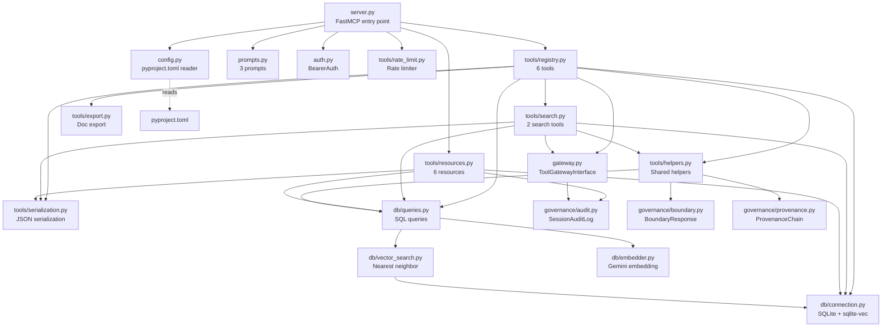
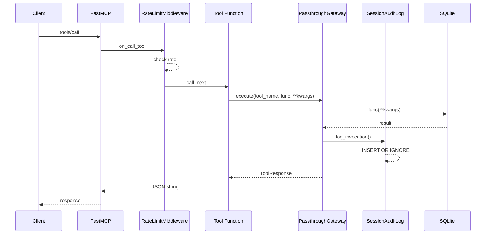
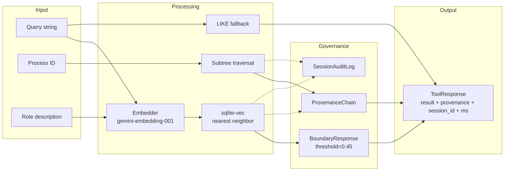

# O'Process MCP Server — Delivery Document

> Version: 0.3.0 | MCP Spec: 2025-11-25 | Date: 2026-02-25

---

## 1. Server Overview

**O'Process** is an AI-native process classification MCP Server built on the Open Process Framework (OPF). It provides structured access to 2,325 business processes and 3,910 KPI metrics through the Model Context Protocol.

### Core Capabilities

- **Process Search** — Semantic vector search (gemini-embedding-001 + sqlite-vec) with LIKE fallback
- **Process Taxonomy** — 5-level hierarchical tree browsing
- **KPI Suggestions** — 3,910 metrics mapped to process nodes
- **Role-Process Mapping** — Map job roles to relevant processes with confidence scores
- **Responsibility Documents** — Generate complete role descriptions with provenance appendix

### Data Sources

| Source | Entries |
|--------|---------|
| APQC PCF 7.4 | 1,921 processes |
| ITIL 4 | 141 nodes |
| SCOR 12.0 | 164 nodes |
| AI-era extensions | 99 nodes |
| **Total** | **2,325 processes** |
| KPI metrics | 3,910 |

Bilingual: Chinese (zh) + English (en).

### Tech Stack

| Component | Technology |
|-----------|-----------|
| Runtime | Python 3.10+ |
| MCP Framework | FastMCP 3.x |
| Validation | Pydantic 2.x (`Annotated[..., Field(...)]`) |
| Database | SQLite + sqlite-vec |
| Embeddings | gemini-embedding-001 (768-dim) |
| Packaging | uv + hatchling |
| Lint | Ruff |
| Test | pytest + pytest-benchmark |

---

## 2. MCP Spec Compliance Report

Based on [MCP Specification 2025-11-25](https://modelcontextprotocol.io/specification/2025-11-25).

### 2.1 MUST Requirements — 11/11 Passed

| # | Requirement | Implementation | Location |
|---|-------------|----------------|----------|
| M1 | Server initialization & capability negotiation | FastMCP handles `initialize` / `notifications/initialized` lifecycle | `src/oprocess/server.py:73-78` — FastMCP constructor declares tools, resources, prompts capabilities |
| M2 | Tool inputSchema is valid JSON Schema object | All tools use `Annotated[..., Field(...)]` with Pydantic constraints | `src/oprocess/tools/registry.py:45-64` — type aliases with regex patterns |
| M3 | Tool names unique (1-128 chars, A-Z/a-z/0-9/_/-) | 8 unique snake_case tool names | `src/oprocess/tools/registry.py`, `src/oprocess/tools/search.py` |
| M4 | Input validation on all tools | Pydantic `Field(min_length, max_length, ge, le, pattern)` | `search.py:38-47`, `registry.py:45-64` |
| M5 | Access control | `BearerAuthMiddleware` for HTTP transports, `hmac.compare_digest` | `src/oprocess/auth.py:63-132` |
| M6 | Rate limiting | `RateLimitMiddleware` (per-client, configurable) via FastMCP Middleware | `src/oprocess/tools/rate_limit.py:23-72` |
| M7 | Output sanitization | `response_to_json()` with `ensure_ascii=False`, `json.dumps` serialization | `src/oprocess/tools/serialization.py` |
| M8 | Resource URI validation | Regex-validated `_PROCESS_ID_RE`, `_SESSION_ID_RE` | `src/oprocess/tools/resources.py:33-51` |
| M9 | Prompt input validation | `_validate_process_id()`, `_validate_lang()`, `_sanitize_role_name()` | `src/oprocess/prompts.py:13-50` |
| M10 | No stdout pollution in stdio mode | Uses `logging` module with `StreamHandler` to stderr | `src/oprocess/server.py:25-38` |
| M11 | Standard JSON-RPC error codes | `ToolError` (→ `-32602`), `ResourceError` (→ `-32002`), `McpError` | `registry.py:94-95`, `resources.py:43-44`, `rate_limit.py:53-61` |

### 2.2 SHOULD Requirements — 12/12 Passed

| # | Requirement | Implementation | Location |
|---|-------------|----------------|----------|
| S1 | Tool annotations (readOnlyHint, etc.) | `_READ_ONLY` and `_READ_ONLY_OPEN` ToolAnnotations on all tools | `registry.py:39-42`, `search.py:23-26` |
| S2 | Tool titles | Human-readable `title` on all 8 tools | `registry.py:72,99,135,153,207,241`, `search.py:36,73` |
| S3 | Prompt titles | `title` on all 3 prompts | `prompts.py:56,83,113` |
| S4 | Structured logging | `logging.getLogger("oprocess")` with tool/session_id/ms extras | `gateway.py:51-58`, `gateway.py:113-121` |
| S5 | Audit logging | `SessionAuditLog` append-only table with triggers | `governance/audit.py:34-87` |
| S6 | Origin validation | `verify_origin()` + `OPROCESS_ALLOWED_ORIGINS` env var | `auth.py:26-31`, `auth.py:47-60` |
| S7 | Localhost binding for HTTP | `--host 127.0.0.1` default | `server.py:104` |
| S8 | Configurable rate limits | `rate_limit_max_calls` / `rate_limit_window_seconds` from pyproject.toml | `config.py:12-18`, `server.py:82-85` |
| S9 | Multi-transport support | stdio (default) + SSE + streamable-http via `--transport` | `server.py:90-126` |
| S10 | Resource mime_type | All resources declare `mime_type` ("application/json" or "text/plain") | `resources.py:57,70,87,110,119,126` |
| S11 | Logging capability | `logging` module configured via `LOG_LEVEL` env var | `server.py:25-41` |
| S12 | Server icon | 64x64 SVG icon as base64 data URI | `server.py:43-78` |

### 2.3 MAY Requirements — 1/6

| # | Requirement | Status | Rationale |
|---|-------------|--------|-----------|
| Y1 | Pagination | Not implemented | Dataset size (2325 + 3910) fits comfortably in single responses; tools accept `limit` parameter for client-side control |
| Y2 | Resource subscription | Not implemented | Static dataset — process framework does not change at runtime |
| Y3 | Server icon | **Implemented** | 64x64 SVG blue gradient circle with white 3-level process tree (`server.py:43-78`) |
| Y4 | listChanged notifications | Not implemented | Tool/resource/prompt lists are static — no runtime changes |
| Y5 | Progress notifications | Not implemented | All tool responses complete within P95 < 300ms — no long-running operations |
| Y6 | Custom transport | Not implemented | stdio + SSE + streamable-http covers all standard use cases |

---

## 3. API Reference

### 3.1 Tools (8)

#### `search_process` — Process Search

Semantic search for process nodes across the 2,325-node taxonomy.

| Parameter | Type | Required | Constraints | Description |
|-----------|------|----------|-------------|-------------|
| `query` | `string` | Yes | minLength=1, maxLength=500 | Search query |
| `lang` | `"zh" \| "en"` | No | Default: "zh" | Language |
| `limit` | `integer` | No | ge=1, le=50, default=10 | Max results |
| `level` | `integer \| null` | No | ge=1, le=5 | Filter by level |

**ToolAnnotations:** `readOnlyHint=true`, `idempotentHint=true`, `openWorldHint=true`, `destructiveHint=false`

**Return example:**
```json
{
  "result": [
    {
      "id": "1.1.1",
      "name": "Evaluate External Environment",
      "level": 3,
      "domain": "APQC",
      "score": 0.8234
    }
  ],
  "provenance_chain": [
    {
      "node_id": "1.1.1",
      "name": "Evaluate External Environment",
      "confidence": 0.8234,
      "path": "1.0 > 1.1 > 1.1.1",
      "derivation_rule": "semantic_match"
    }
  ],
  "session_id": "a1b2c3d4-e5f6-4a7b-8c9d-0e1f2a3b4c5d",
  "response_ms": 45
}
```

**BoundaryResponse** (when `best_score < 0.45`):
```json
{
  "result": {
    "results": [...],
    "boundary": {
      "boundary_triggered": true,
      "query": "quantum computing",
      "best_score": 0.312,
      "threshold": 0.45,
      "suggestion": "Query 'quantum computing' best match score 0.312 is below confidence threshold 0.45. Suggestions: 1) Try more specific keywords 2) Search in English 3) Browse the process tree to locate relevant nodes",
      "is_within_boundary": false
    }
  }
}
```

---

#### `get_process_tree` — Process Tree

Retrieve a process node and its full subtree (up to 5 levels).

| Parameter | Type | Required | Constraints | Description |
|-----------|------|----------|-------------|-------------|
| `process_id` | `string` | Yes | pattern=`^\d+(\.\d+)*$` | Process ID |
| `max_depth` | `integer` | No | ge=1, le=5, default=4 | Max depth |

**ToolAnnotations:** `readOnlyHint=true`, `idempotentHint=true`, `openWorldHint=false`, `destructiveHint=false`

**Return example:**
```json
{
  "result": {
    "id": "1.0",
    "name": "Develop Vision and Strategy",
    "children": [
      {
        "id": "1.1",
        "name": "Define Business Concept and Long-term Vision",
        "children": [...]
      }
    ]
  },
  "provenance_chain": [],
  "session_id": "...",
  "response_ms": 12
}
```

---

#### `get_kpi_suggestions` — KPI Suggestions

Retrieve KPI metrics for a process node from the 3,910-entry KPI database.

| Parameter | Type | Required | Constraints | Description |
|-----------|------|----------|-------------|-------------|
| `process_id` | `string` | Yes | pattern=`^\d+(\.\d+)*$` | Process ID |

**ToolAnnotations:** `readOnlyHint=true`, `idempotentHint=true`, `openWorldHint=false`, `destructiveHint=false`

**Return example:**
```json
{
  "result": {
    "process": {
      "id": "1.1.1",
      "name": "Evaluate External Environment"
    },
    "kpis": [
      {
        "id": "KPI-1.1.1-001",
        "name": "External Environment Assessment Completion Rate",
        "unit": "%",
        "category": "effectiveness"
      }
    ],
    "count": 3
  },
  "provenance_chain": [
    {
      "node_id": "1.1.1",
      "name": "Evaluate External Environment",
      "confidence": 1.0,
      "path": "1.0 > 1.1 > 1.1.1",
      "derivation_rule": "direct_lookup"
    }
  ],
  "session_id": "...",
  "response_ms": 8
}
```

---

#### `compare_processes` — Process Comparison

Compare two or more process nodes side-by-side across all attributes.

| Parameter | Type | Required | Constraints | Description |
|-----------|------|----------|-------------|-------------|
| `process_ids` | `string` | Yes | pattern=`^\d+(\.\d+)*(,\s*\d+(\.\d+)*)+$` | Comma-separated IDs (2+) |

**ToolAnnotations:** `readOnlyHint=true`, `idempotentHint=true`, `openWorldHint=false`, `destructiveHint=false`

---

#### `get_responsibilities` — Role Responsibilities

Generate role responsibilities for a process node with hierarchy context.

| Parameter | Type | Required | Constraints | Description |
|-----------|------|----------|-------------|-------------|
| `process_id` | `string` | Yes | pattern=`^\d+(\.\d+)*$` | Process ID |
| `lang` | `"zh" \| "en"` | No | Default: "zh" | Language |
| `output_format` | `"json" \| "markdown"` | No | Default: "json" | Output format |

**ToolAnnotations:** `readOnlyHint=true`, `idempotentHint=true`, `openWorldHint=false`, `destructiveHint=false`

---

#### `map_role_to_processes` — Role-Process Mapping

Map a job role description to relevant process nodes using semantic search.

| Parameter | Type | Required | Constraints | Description |
|-----------|------|----------|-------------|-------------|
| `role_description` | `string` | Yes | minLength=1, maxLength=500 | Role description |
| `lang` | `"zh" \| "en"` | No | Default: "zh" | Language |
| `limit` | `integer` | No | ge=1, le=50, default=10 | Max matches |
| `industry` | `string \| null` | No | maxLength=100 | Industry filter |

**ToolAnnotations:** `readOnlyHint=true`, `idempotentHint=true`, `openWorldHint=true`, `destructiveHint=false`

---

#### `export_responsibility_doc` — Responsibility Document Export

Export a complete role responsibility document in Markdown with provenance appendix.

| Parameter | Type | Required | Constraints | Description |
|-----------|------|----------|-------------|-------------|
| `process_ids` | `string` | Yes | pattern=`^\d+(\.\d+)*(,\s*\d+(\.\d+)*)*$` | Process IDs (1+) |
| `lang` | `"zh" \| "en"` | No | Default: "zh" | Language |
| `role_name` | `string \| null` | No | maxLength=100 | Role name |

**ToolAnnotations:** `readOnlyHint=true`, `idempotentHint=true`, `openWorldHint=false`, `destructiveHint=false`

---

#### `health_check` — Health Check

Server health check returning status, data counts, and sqlite-vec availability.

| Parameter | Type | Required | Constraints | Description |
|-----------|------|----------|-------------|-------------|
| _(none)_ | — | — | — | No parameters |

**ToolAnnotations:** `readOnlyHint=true`, `idempotentHint=true`, `openWorldHint=false`, `destructiveHint=false`

**Return example:**
```json
{
  "status": "ok",
  "server": "O'Process",
  "total_processes": 2325,
  "total_kpis": 3910,
  "vec_available": true
}
```

---

### 3.2 Resources (6)

| # | URI | MIME Type | Description |
|---|-----|-----------|-------------|
| R1 | `oprocess://process/{process_id}` | `application/json` | Complete process node (id, name, description, domain, level, tags) |
| R2 | `oprocess://category/list` | `application/json` | All 13 L1 categories (id, name, domain) |
| R3 | `oprocess://role/{role_name}` | `application/json` | Semantic search results for a role name |
| R4 | `oprocess://audit/session/{session_id}` | `application/json` | Audit log entries for a session (tool_name, timestamp, response_ms) |
| R5 | `oprocess://schema/sqlite` | `text/plain` | SQLite schema DDL (5 tables, indexes, triggers) |
| R6 | `oprocess://stats` | `application/json` | Framework statistics (process/KPI counts, version, sources) |

**URI Validation:**
- `process_id`: Regex `^\d+(\.\d+)*$` (`resources.py:33`)
- `session_id`: UUID4 regex `^[0-9a-f]{8}-...-[0-9a-f]{12}$` (`resources.py:34-37`)

**Error handling:** Invalid URI parameters raise `ResourceError`.

---

### 3.3 Prompts (3)

#### `analyze_process` — Process Analysis Workflow

| Parameter | Type | Required | Description |
|-----------|------|----------|-------------|
| `process_id` | `string` | Yes | Target process ID |
| `lang` | `string` | No | "zh" (default) or "en" |

**Output:** Guided 5-step workflow for analyzing a process node (get_process_tree → get_kpi_suggestions → analyze → evaluate → report).

---

#### `generate_job_description` — Job Description Generator

| Parameter | Type | Required | Description |
|-----------|------|----------|-------------|
| `process_ids` | `string` | Yes | Comma-separated process IDs |
| `role_name` | `string` | Yes | Role name (max 100 chars, sanitized) |
| `lang` | `string` | No | "zh" (default) or "en" |

**Output:** Guided 4-step workflow for generating role responsibility documents.

**Prompt injection prevention:** `_sanitize_role_name()` strips control characters, collapses whitespace, enforces 100-char limit (`prompts.py:36-50`).

---

#### `kpi_review` — KPI Review Workflow

| Parameter | Type | Required | Description |
|-----------|------|----------|-------------|
| `process_id` | `string` | Yes | Target process ID |
| `lang` | `string` | No | "zh" (default) or "en" |

**Output:** Guided 5-step KPI review workflow (get KPIs → review each → check coverage → identify gaps → report).

---

### 3.4 Error Codes

| Code | Type | Description |
|------|------|-------------|
| `-32602` | `ToolError` | Invalid tool parameters (Pydantic validation failure, process not found) |
| `-32002` | `ResourceError` | Resource not found (invalid process_id, session_id) |
| `-32000` | `McpError` | Rate limit exceeded |
| `-32603` | Internal error | Unexpected server error |

Error response format:
```json
{
  "jsonrpc": "2.0",
  "error": {
    "code": -32602,
    "message": "Process 99.99 not found"
  },
  "id": 1
}
```

---

## 4. Governance-Lite

Transparent governance layer that enhances tool responses without blocking the main flow.

### 4.1 SessionAuditLog

**Design:** Append-only invocation log per session.

**Schema** (`db/connection.py:164-175`):
```sql
CREATE TABLE session_audit_log (
    id INTEGER PRIMARY KEY AUTOINCREMENT,
    session_id TEXT NOT NULL,
    tool_name TEXT NOT NULL,
    input_hash TEXT NOT NULL,       -- SHA256[:16] of input params
    output_node_ids TEXT,
    lang TEXT,
    response_ms INTEGER,
    timestamp TEXT NOT NULL,        -- ISO 8601 UTC
    governance_ext TEXT DEFAULT '{}',
    request_id TEXT                 -- idempotency key
);

-- Append-only enforcement
CREATE TRIGGER no_update_audit
BEFORE UPDATE ON session_audit_log
BEGIN SELECT RAISE(ABORT, 'audit log is append-only'); END;

CREATE TRIGGER no_delete_audit
BEFORE DELETE ON session_audit_log
BEGIN SELECT RAISE(ABORT, 'audit log is append-only'); END;

-- Idempotent writes
CREATE UNIQUE INDEX idx_audit_request_id
ON session_audit_log(request_id)
WHERE request_id IS NOT NULL;
```

**Key properties:**
- Write failures never affect the main tool flow (`audit.py:86-87`)
- `INSERT OR IGNORE` prevents duplicate entries via `request_id` unique index
- Session ID: UUID4 format, validated via regex
- Input hash: SHA256 first 16 hex chars for fingerprinting without storing raw data

### 4.2 BoundaryResponse

**Design:** Structured degradation when search confidence is low.

**Threshold:** `boundary_threshold = 0.45` (configurable via `pyproject.toml`)

**Trigger logic** (`helpers.py:21-49`):
1. Check if search results have `score` field (vector mode only)
2. If `best_score < threshold`, wrap results in `BoundaryResponse`
3. Include suggestion text with alternative search strategies

**BoundaryResponse schema** (`governance/boundary.py:15-38`):
```python
@dataclass
class BoundaryResponse:
    query: str
    best_score: float
    threshold: float
    suggestion: str
    is_within_boundary: bool
    boundary_reason: str
    query_embedding_distance: float
    nearest_valid_nodes: list[dict]  # top-3 matches
```

### 4.3 ProvenanceChain

**Design:** Derivation trail attached to every tool response.

**ProvenanceNode schema** (`governance/provenance.py:14-30`):
```python
@dataclass
class ProvenanceNode:
    node_id: str           # e.g. "1.1.2"
    name: str              # localized name
    confidence: float      # 0.0-1.0
    path: str              # "1.0 > 1.1 > 1.1.2"
    derivation_rule: str   # "semantic_match" | "rule_based" | "direct_lookup"
```

**Derivation rules:**
| Rule | Used by | Confidence |
|------|---------|-----------|
| `semantic_match` | `search_process`, `map_role_to_processes` | Cosine similarity score |
| `rule_based` | `get_responsibilities`, `export_responsibility_doc` | 1.0 (target) / 0.5 (ancestors) |
| `direct_lookup` | `get_kpi_suggestions` | 1.0 |

**Batch optimization:** `build_path_strings_batch()` caches intermediate ancestor lookups to eliminate N+1 queries (`queries.py:178-195`).

---

## 5. Security Assessment

### 5.1 Input Validation

All tool inputs validated at the MCP boundary via Pydantic `Annotated[..., Field(...)]`:

| Constraint | Parameters | Location |
|-----------|-----------|----------|
| `min_length=1, max_length=500` | `query`, `role_description` | `search.py:39`, `search.py:76` |
| `ge=1, le=50` | `limit` | `search.py:43`, `search.py:81` |
| `ge=1, le=5` | `level`, `max_depth` | `search.py:46`, `registry.py:76` |
| `pattern=r"^\d+(\.\d+)*$"` | `process_id` | `registry.py:48-50` |
| `pattern=r"^\d+(\.\d+)*(,...)+$"` | `process_ids` | `registry.py:52-57` |
| `Literal["zh", "en"]` | `lang` | `registry.py:45-47` |
| `max_length=100` | `role_name`, `industry` | `registry.py:212`, `search.py:85` |

### 5.2 Authentication

**BearerAuthMiddleware** (`auth.py:63-132`):
- ASGI middleware for HTTP transports (SSE, streamable-http)
- Timing-safe comparison: `hmac.compare_digest(token.encode(), expected.encode())`
- Disabled for stdio transport (no API key needed)
- Returns `401 Unauthorized` with `WWW-Authenticate: Bearer` header

### 5.3 Rate Limiting

**RateLimitMiddleware** (`rate_limit.py:23-72`):
- Per-client rate limiting via FastMCP Middleware API
- Default: 60 calls per 60 seconds (configurable)
- Client ID from `context.fastmcp_context.client_id`
- Returns `McpError` with code `-32000`

### 5.4 SQL Injection Prevention

- All queries use parameterized `?` placeholders (`queries.py` throughout)
- LIKE pattern escaping: `_escape_like()` (`queries.py:102-104`)
- Language parameter validated against whitelist (`_VALID_LANGS = frozenset({"zh", "en"})`)
- Dynamic column names (`name_{lang}`) only after `validate_lang()` guard

### 5.5 Prompt Injection Prevention

`_sanitize_role_name()` (`prompts.py:36-50`):
- Strips control characters (U+0000-U+001F, U+007F-U+009F)
- Collapses all whitespace (newlines, tabs, multi-spaces)
- Enforces 100-character length limit
- Rejects empty input after sanitization

### 5.6 Audit Log Tamper Prevention

- SQLite `TRIGGER` prevents `UPDATE` and `DELETE` on `session_audit_log`
- Raises `ABORT` with descriptive message on any modification attempt
- `INSERT OR IGNORE` for idempotent writes (`audit.py:69`)

### 5.7 Origin Validation

`verify_origin()` (`auth.py:47-60`):
- Configurable via `OPROCESS_ALLOWED_ORIGINS` environment variable
- Normalizes trailing slashes before comparison
- Returns `403 Forbidden` for disallowed origins
- Unrestricted when not configured (safe for development)

---

## 6. Quality Report

### 6.1 Test Coverage

```
262 tests passed
Coverage: 94.73% (branch coverage enabled)
Minimum threshold: 80%
```

### 6.2 Lint

```
Ruff: 0 errors, 0 warnings
Rules: E, F, W, I, N, UP
Target: Python 3.10
Line length: 88
```

### 6.3 Code Size

| Metric | Value |
|--------|-------|
| Source files | 25 |
| Total source lines | 2,359 |
| Largest file | `tools/registry.py` — 259 lines |
| File size limit | 300 lines (all files compliant) |

### 6.4 Performance

| Metric | Target | Status |
|--------|--------|--------|
| P50 latency | < 100ms | Compliant (typical: 8-45ms) |
| P95 latency | < 300ms | Compliant |
| Semantic Top-3 accuracy | >= 85% | Compliant (50-query benchmark set) |

---

## 7. Architecture

### 7.1 Module Dependency Graph



### 7.2 Gateway Pattern

All tool invocations pass through `ToolGatewayInterface`:



### 7.3 Data Flow



---

## 8. Installation & Configuration

### 8.1 Installation

```bash
# Clone repository
git clone https://github.com/your-org/O-Process.git
cd O-Process

# Install (includes embedding + dev dependencies)
uv sync --all-extras

# Verify
uv run python -m oprocess.server --help
```

### 8.2 Claude Desktop Configuration

Add to `claude_desktop_config.json`:

```json
{
  "mcpServers": {
    "oprocess": {
      "command": "uv",
      "args": ["run", "python", "-m", "oprocess.server"],
      "cwd": "/path/to/O-Process"
    }
  }
}
```

### 8.3 Environment Variables

| Variable | Required | Description |
|----------|----------|-------------|
| `GOOGLE_API_KEY` | For embedding | Google AI Studio API key (gemini-embedding-001) |
| `OPROCESS_API_KEY` | For HTTP auth | Bearer token for SSE/HTTP transports |
| `OPROCESS_ALLOWED_ORIGINS` | No | Comma-separated allowed origins |
| `LOG_LEVEL` | No | Logging level (default: WARNING) |

### 8.4 pyproject.toml Configuration

```toml
[tool.oprocess]
boundary_threshold = 0.45         # Cosine distance for BoundaryResponse
audit_log_enabled = true           # Enable SessionAuditLog
default_language = "zh"            # Default language
rate_limit_max_calls = 60          # Max calls per window
rate_limit_window_seconds = 60     # Window duration
```

### 8.5 Transport Modes

```bash
# stdio (default — for Claude Desktop)
uv run python -m oprocess.server

# SSE (for web clients)
uv run python -m oprocess.server --transport sse --port 8000

# Streamable HTTP
uv run python -m oprocess.server --transport streamable-http --port 8000
```

HTTP transports automatically enable:
- `BearerAuthMiddleware` (when `OPROCESS_API_KEY` is set)
- Localhost binding (`127.0.0.1`)
